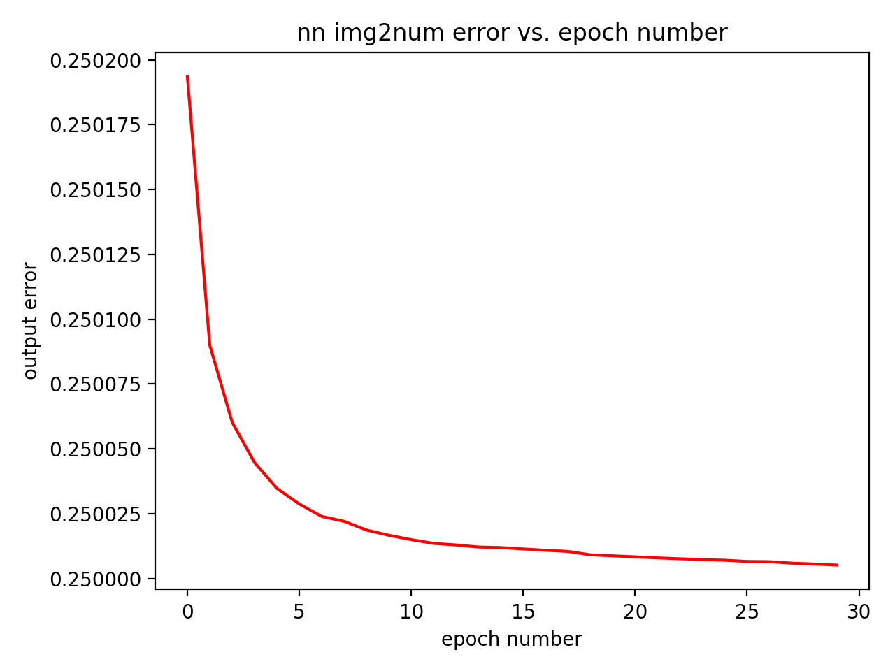
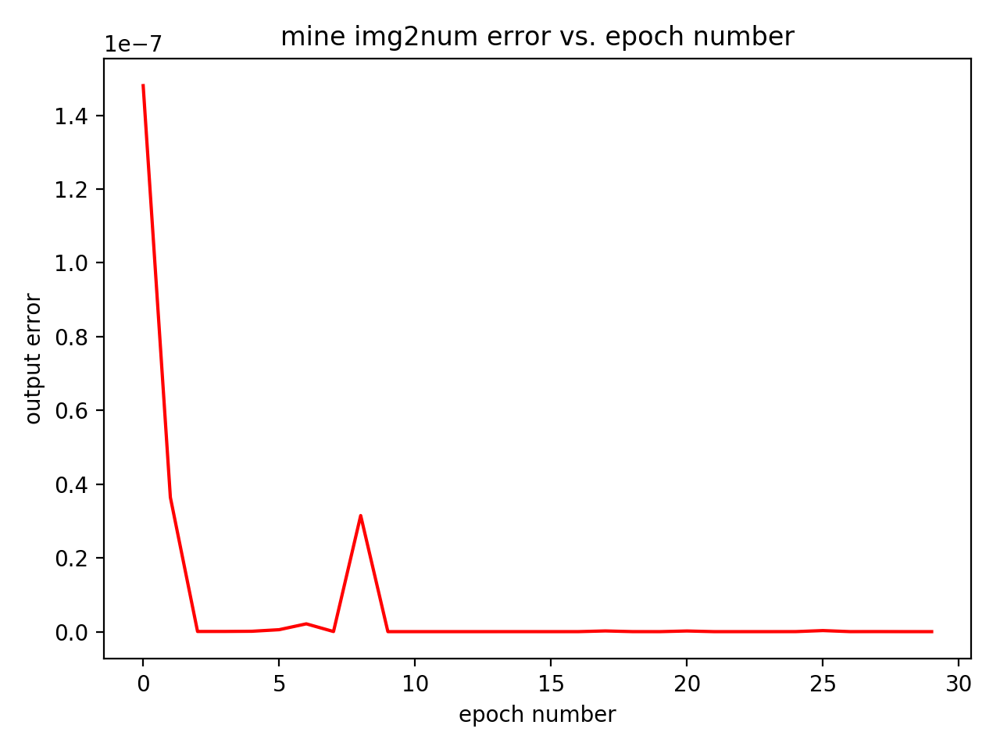
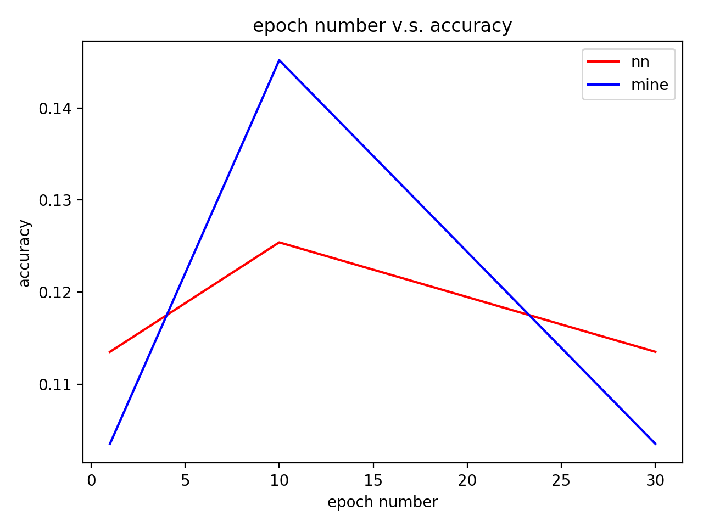
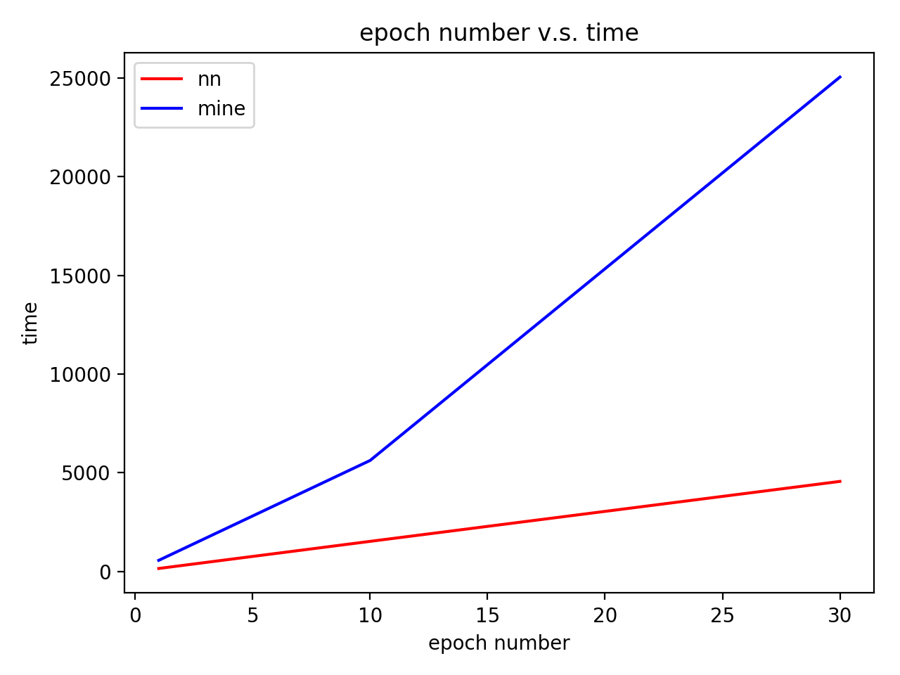

### Neural Networks - Back-propagation pass
##### Author: Li-Hsin Tseng
Source code: NeuralNetwork.py, my_img2num.py, nn_img2num.py

In this project, we are going to compare the results on accuracy and time between torch.nn library and my own implementation of building a network. We are using the MNIST dataset to identify photos of hand written numbers.

Before feeding the inputs to the network, one need to make sure that the shape of the images matches what the network wants it to be. I also did the one-hot encoding to the labels before feeding it to the network.

* Comparison between training error and the corresponding epoch number

|       nn_img2num        |        my_img2num        |
|:-----------------------:| ------------------------:|
| ||

* Comparison between epoch number and the resulting accuracy between nn_img2num and my_img2num

The accuracy didn't simply goes down along with increasing epoch number.

* Comparison between epoch number and the time taken during training between nn_img2num and my_img2num

It's quite straightforward that the time takes for training increases when the epoch number increases

